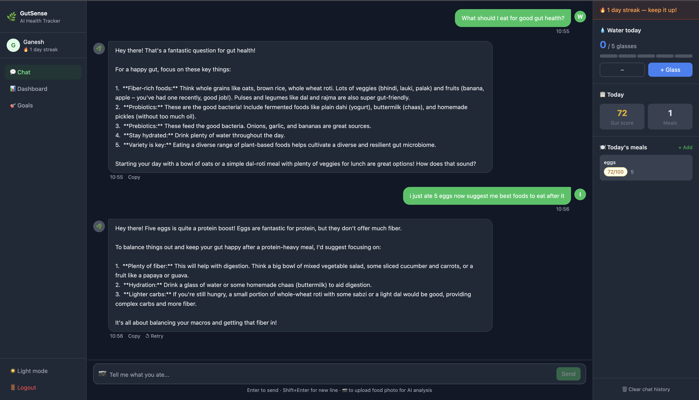
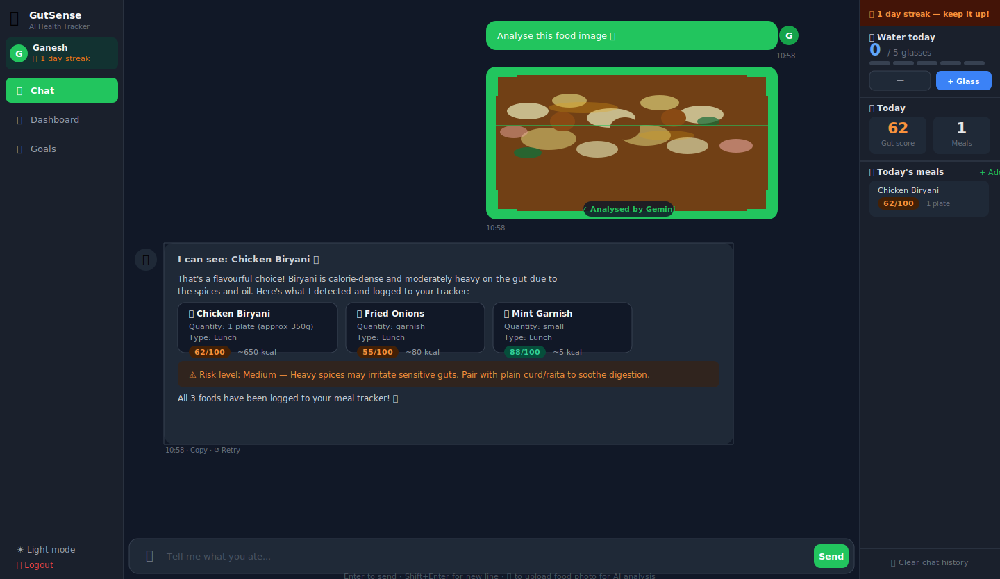
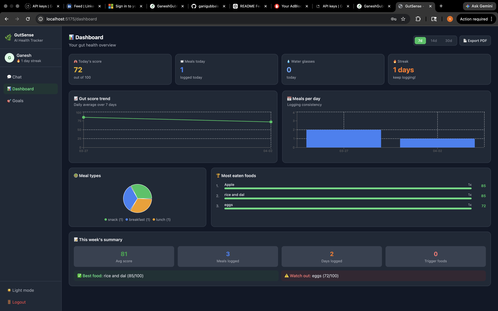
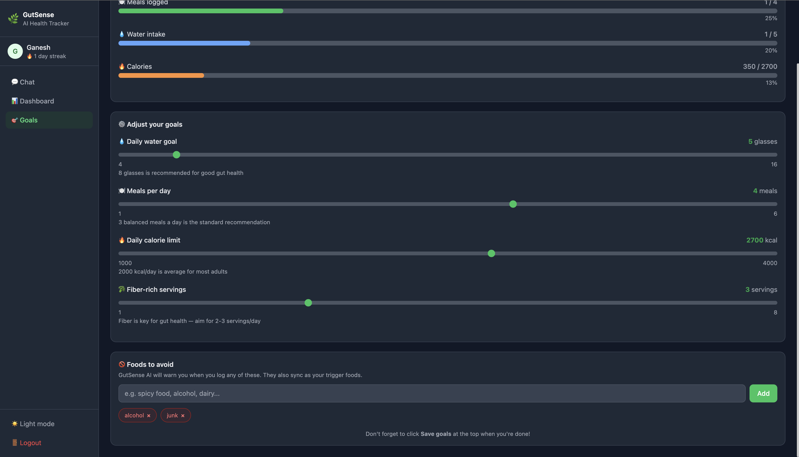
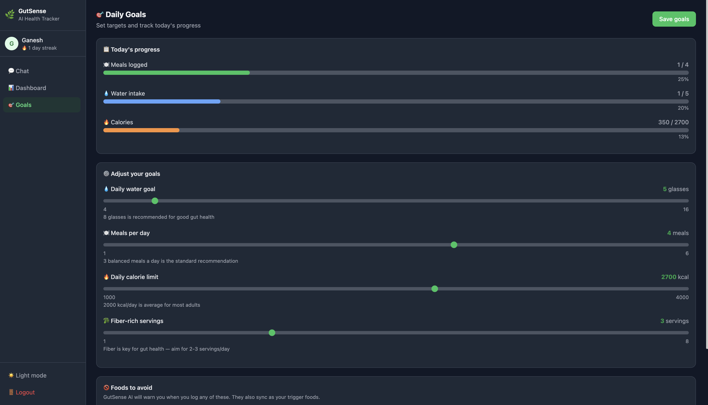

<div align="center">


<br/>

**A production-grade full-stack MERN application that uses Google Gemini AI to track your digestive health through natural conversation and food photo analysis.**

<br/>

[](./backend/__tests__)
[](https://nodejs.org)
[](https://react.dev)
[](https://mongodb.com)
[](https://ai.google.dev)
[](./LICENSE)

<br/>

[**Live Demo**](https://gutsense.onrender.com) · [**API Docs**](#-api-reference) · [**Quick Start**](#-quick-start) · [**Architecture**](#-architecture)

</div>

---

## 📸 Screenshots

### 💬 AI Chat — Talk to log your meals


> Just describe what you ate in plain language. The AI extracts every food item, calculates a gut health score, flags trigger foods, and logs everything to MongoDB — no forms, no searching, no manual input.

---

### 📷 Food Image Recognition — Photograph your meal, AI does the rest


> Upload any food photo and Gemini Vision API identifies every item on the plate, estimates portion sizes and calories, assigns individual gut health scores, and logs all entries automatically. Zero typing required.

---

### 📊 Analytics Dashboard — See your gut health trends


> Real-time charts powered by MongoDB aggregation pipelines. Switch between 7, 14, or 30-day views. Export your full weekly report as a PDF with one click.

---

### 📊 Dashboard — Weekly Summary


> This week's gut health summary — average score, meals logged, days tracked, best and worst foods all in one view.

---

### 🎯 Daily Goals — Set targets, track progress


> Set your daily water, meal, calorie, and fiber goals with sliders. Add foods to your avoid list and the AI will warn you in real-time when you log them. Progress bars update live throughout the day.

---

### 📄 PDF Export — Weekly Health Report


> One-click export of your full weekly health report — gut score summary, meals grouped by day, water intake history, best and worst foods. Opens a formatted print window ready to save as PDF.

---

## 🧠 What makes this different

Most food trackers make you search a database and manually fill in calories. GutSense works differently — you just **talk to it**.

```
You:  "just had biryani with raita and a cold drink"
AI:   Logged ✓  Biryani (lunch) · Raita · Cold drink
      ⚠️  Cold drinks can slow digestion. Raita was a great
      choice — probiotics help offset heavy meals. Gut score: 68/100
```

The AI reads your message, extracts every food item, estimates calories, assigns a gut health score, and writes it to MongoDB — **all in one message, zero manual input.**

---

## ✨ Feature Overview

| Feature | What it does |
|---|---|
| 🤖 **AI Chat** | Gemini 1.5 Flash parses natural language and auto-logs meals |
| 📷 **Image Recognition** | Photograph food → Gemini Vision identifies it → auto-logged |
| 📊 **Analytics Dashboard** | 7/14/30-day gut score trends, meal charts, top foods — Recharts |
| ⚠️ **Trigger Food Alerts** | AI warns in real-time when you log a food from your avoid list |
| 🎯 **Daily Goals** | Water, meals, calories, fiber — with live progress bars |
| 🔥 **Streak System** | Daily logging streak tracked per user in MongoDB |
| 📄 **PDF Export** | One-click weekly health report with full meal history |
| 🌙 **Dark Mode** | Persisted to localStorage, toggle in sidebar |
| 📱 **PWA Ready** | Installable on mobile via web app manifest |
| 🔐 **Secure Auth** | JWT in httpOnly cookies, bcrypt, rate limiting, NoSQL injection protection |
| 🧪 **46 Tests** | Jest + Supertest across auth, meals, goals, water, security |
| 🚀 **CI/CD** | GitHub Actions runs full test suite on every push |

---

## 🏗 Architecture

```
┌─────────────────────────────────────────────────────────────┐
│                        CLIENT (React 18)                     │
│                                                             │
│   AuthContext ──► useChat hook ──► Axios (api.js)           │
│        │               │                  │                 │
│   Protected       Optimistic UI      Bearer token +         │
│    Routes          + streaming       httpOnly cookie         │
└────────────────────────────┬────────────────────────────────┘
                             │ HTTPS
┌────────────────────────────▼────────────────────────────────┐
│                    EXPRESS API (Node.js)                      │
│                                                             │
│  helmet ──► mongoSanitize ──► rateLimiter ──► JWT guard     │
│                                                             │
│  /api/auth    /api/meals    /api/goals    /api/analytics    │
│  /api/chat    /api/water    /api/report                     │
│                    │                                        │
│            Gemini 1.5 Flash API                             │
│         (chat + Vision image analysis)                      │
└────────────────────────────┬────────────────────────────────┘
                             │
┌────────────────────────────▼────────────────────────────────┐
│                       MONGODB ATLAS                          │
│                                                             │
│   users    meals    goals    water    chats                 │
│              │                                              │
│        Compound index                                       │
│        { user, eatenAt }  ◄── sub-100ms aggregations       │
└─────────────────────────────────────────────────────────────┘
```

---

## 🔐 Security Implementation

This isn't a tutorial project with `localStorage` tokens. Here's what's actually implemented:

```js
// JWT stored in httpOnly cookie — JS cannot read it (XSS protection)
res.cookie("gut_token", token, {
  httpOnly: true,
  secure: process.env.NODE_ENV === "production",  // HTTPS only in prod
  sameSite: "strict",                              // CSRF protection
  maxAge: 7 * 24 * 60 * 60 * 1000,               // 7 days
});
```

```js
// Rate limiting — brute force protection on auth routes
const authLimiter = rateLimit({
  windowMs: 15 * 60 * 1000,   // 15 minutes
  max: 10,                     // 10 attempts max
});
```

```js
// NoSQL injection blocked on every request
app.use(mongoSanitize());
// Strips { email: { $gt: "" } } attacks from all request bodies
```

| Layer | Tool | What it blocks |
|---|---|---|
| Headers | `helmet` | Clickjacking, MIME sniffing, XSS |
| Rate limit | `express-rate-limit` | Brute force, API abuse |
| Injection | `express-mongo-sanitize` | NoSQL operator injection |
| Auth | `httpOnly cookie + JWT` | XSS token theft |
| Passwords | `bcryptjs` (12 rounds) | Rainbow table attacks |

---

## 🧩 How the AI food logging works

```
User message: "had dal chawal for lunch and aam panna"
                            │
                    Sent to Gemini with:
                    - System prompt (gut health expert)
                    - User's recent meal history (context)
                    - Last 8 chat messages (context)
                            │
              Gemini replies with advice +
              structured FOOD_LOG at the end:
              FOOD_LOG: [
                { "food": "dal chawal", "mealType": "lunch", "calories": 380 },
                { "food": "aam panna",  "mealType": "snack", "calories": 80  }
              ]
                            │
              Backend strips FOOD_LOG from reply,
              checks against user triggerFoods,
              calculates gut score, saves to MongoDB
                            │
              Frontend shows clean AI reply +
              refreshes meal sidebar automatically
```

---

## 📊 API Reference

| Method | Endpoint | Auth | Description |
|---|---|---|---|
| `POST` | `/api/auth/register` | ❌ | Register, sets httpOnly cookie |
| `POST` | `/api/auth/login` | ❌ | Login, sets httpOnly cookie |
| `POST` | `/api/auth/logout` | ❌ | Clears cookie |
| `GET` | `/api/auth/me` | ✅ | Current user |
| `GET` | `/api/meals` | ✅ | Today's meals |
| `POST` | `/api/meals` | ✅ | Manual meal log |
| `DELETE` | `/api/meals/:id` | ✅ | Delete meal |
| `POST` | `/api/chat/send` | ✅ | AI chat + image analysis |
| `GET` | `/api/chat/history` | ✅ | Chat history |
| `GET` | `/api/analytics/dashboard?days=7` | ✅ | Charts data |
| `GET` | `/api/analytics/weekly-report` | ✅ | Weekly summary |
| `GET` | `/api/goals` | ✅ | User goals |
| `PUT` | `/api/goals` | ✅ | Update goals |
| `POST` | `/api/water/add` | ✅ | Log a glass |
| `GET` | `/api/report/export` | ✅ | PDF report data |

---

## 🧪 Testing

**46 tests** across 5 suites covering the full API surface.

```bash
cd backend && npm test
```

```
 PASS  __tests__/auth.test.js
    ✓ registers a new user and returns token + user object
    ✓ sets an httpOnly cookie on register
    ✓ rejects duplicate email registration
    ✓ does not store plain-text password in database

 PASS  __tests__/meals.test.js
    ✓ logs a meal and returns it with a gut score
    ✓ gives healthy foods a higher gut score than junk food
    ✓ flags a trigger food when it matches user avoid list
    ✓ only returns meals belonging to the requesting user
    ✓ returns 404 when deleting another user's meal

 PASS  __tests__/security.test.js
    ✓ blocks NoSQL injection in login email field
    ✓ GET /api/meals returns 401 without token
    ✓ GET /api/analytics/dashboard returns 401 without token
    ✓ includes security headers from helmet
    ✓ rejects a tampered JWT token

 PASS  __tests__/goals.test.js
 PASS  __tests__/water.test.js

Test Suites: 5 passed, 5 total
Tests:       46 passed, 46 total
```

---

## ⚡ Quick Start

**Prerequisites:** Node.js 18+, MongoDB running locally or Atlas URI

```bash
# 1. Clone
git clone https://github.com/ganigubbala/GutSense.git
cd GutSense

# 2. Backend
cd backend
npm install
cp .env.example .env
# → Edit .env: add MONGO_URI, JWT_SECRET, GEMINI_API_KEY
npm run dev
# ✅ Server  → http://localhost:5001
# ✅ Health  → http://localhost:5001/api/health

# 3. Frontend (new terminal)
cd frontend
npm install
npm run dev
# ✅ App → http://localhost:5173

# 4. Run tests
cd backend && npm test
```

**Get a free Gemini API key:** https://aistudio.google.com/app/apikey

---

## 🌍 Deploy to Render (free)

```bash
# 1. Push to GitHub
# 2. render.com → New → Blueprint → connect repo
# 3. Render reads render.yaml automatically
# 4. Set env vars in dashboard: MONGO_URI, JWT_SECRET, GEMINI_API_KEY
```

---

## 📁 Project Structure

```
gutsense-ai/
├── .github/workflows/ci.yml     # GitHub Actions CI
├── render.yaml                  # Render.com deploy config
│
├── backend/
│   ├── __tests__/
│   │   ├── auth.test.js         # 12 tests
│   │   ├── meals.test.js        # 10 tests
│   │   ├── goals.test.js        #  6 tests
│   │   ├── water.test.js        #  5 tests
│   │   └── security.test.js     # 13 tests
│   ├── middleware/auth.js        # JWT (cookie + Bearer)
│   ├── models/                  # User, Meal, Goal, Water, Chat
│   ├── routes/                  # 7 route modules, 15 endpoints
│   └── server.js                # helmet, rate limit, sanitize
│
└── frontend/
    └── src/
        ├── context/AuthContext.jsx
        ├── hooks/useChat.js
        ├── utils/api.js
        └── pages/               # Chat, Dashboard, Goals, Login, Register
```

---

## 🛠 Tech Stack

**Frontend** — React 18, Vite, Tailwind CSS, Recharts, React Router v6, Axios

**Backend** — Node.js, Express, MongoDB, Mongoose, JWT, bcryptjs, helmet, express-rate-limit, express-mongo-sanitize

**AI** — Google Gemini 1.5 Flash (chat) · Gemini Vision API (image recognition)

**DevOps** — Jest, Supertest, GitHub Actions CI, Render.com, PWA Manifest

---

## 📈 What I'd add next

- [ ] Push notifications when streak is about to break
- [ ] Open Food Facts API integration for accurate calorie data
- [ ] Doctor report sharing via email (Nodemailer)
- [ ] React Native mobile app (Expo)

---

<div align="center">

**Built with ❤️ and too much chai**

If this project helped you, drop a ⭐ — it means a lot!

</div>
